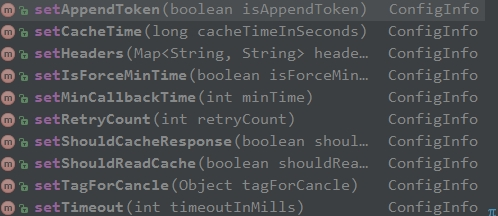

# NetWrapper

基于retrofit封装,面向接口,链式调用,使用时不设计retrofit中的类.可继承BaseNet类来无缝切换到其他网络,如volley.


# 已完成

缓存完全由客户端自行控制(ACache)

上传和下载的进度回调(填了很大的坑)


# todo

## 下载策略

```
/**
 * 下载的一些通用策略:  downloadStratege

 * 1. 是否用url中的文件名作为最终的文件名,或者指定文件名
 * 2.如果是图片,音频,视频等多媒体文件,是否在下载完成后让mediacenter扫描一下?
 * 3. 如果是apk文件,是否在下载完成后打开?或者弹窗提示用户?
 * 4. md5校验 : 是否预先提供md5 ,下载完后与文件md5比较,以确定所下载的文件的完整性?
 * 5.断点续传的实现
 
 	6.下载队列和指定同时下载文件的个数
 * */
```


## 缓存

无网络时读缓存

利用http请求头来完全屏蔽okhttp的缓存体系

缓存文件夹大小的设置


# usage

```
getString(String url, Map map, MyNetListener listener).setXxx()....start();

//中间的setXxx可以没有,如:

 MyNetApi.getString("http://www.qxinli.com/Application/about/androidAbout.html", 
 new HashMap(),  
 new MyNetListener<String>() {
                    @Override
                    public void onSuccess(String response, String resonseStr) {
                        Logger.e(response);

                    }
                }).start();
                
其他api:

postString( String url,  Map map,  MyNetListener listener).start()


//标准json

postStandardJsonResonse( String url,  Map map, Class clazz, MyNetListener listener).start()

getStandardJsonResonse( String url,  Map map, Class clazz, MyNetListener listener).start()


//普通jsonObject和JsonArray

postCommonJsonResonse( String url,  Map map, Class clazz, MyNetListener listener).start()

getCommonJsonResonse( String url,  Map map, Class clazz, MyNetListener listener).start()

//上传和下载

download(String url, String savedpath, MyNetListener listener).start()

upLoad(String url, Map<String,String> params,Map<String,String> files, MyNetListener callback).start()

```


## 供链式调用的相关的set方法有:

 


## json的解析: 

如果是jsonObject,

clazz传入实体类的Class,同时MyNetListener泛型设置为该实体类

如果JsonArray,:

clazz传入数组元素类的Class,同时MyNetListener泛型设置为该实体类,其回调采用

```
onSuccessArr(List<T> response,String resonseStr)
```


# 标准格式json的解析

## api:

getStandardJsonResonse

postStandardJsonResonse


## 请求的配置

### 默认字段和code码

```java
ConfigInfo:
public  static  String KEY_DATA = "data";
public static  String KEY_CODE = "code";
public static  String KEY_MSG = "msg";

BaseNetBean:
public static final int CODE_NONE = -1;
public static  int CODE_SUCCESS = 0;
public static  int CODE_UNLOGIN = 2;
public static  int CODE_UN_FOUND = 3;
```

### 全局配置

    MyNetApi:

```java
/**
 * 指定标准格式json的三个字段.比如聚合api的三个字段分别是error_code(但有的又是resultcode),reason,result,error_code
 * @param data
 * @param code
 * @param msg
 * @param codeSuccess
 * @param codeUnlogin
 * @param codeUnfound
 */
public static void setStandardJsonKey(String data,String code,String msg,int codeSuccess,int codeUnlogin,int codeUnfound)
```

### 单个请求的配置

    ConfigInfo:

```java
 public ConfigInfo<T> setStandardJsonKey(String keyData,String keyCode,String keyMsg)

 public ConfigInfo<T> setStandardJsonKeyCode(String keyCode)

 public ConfigInfo<T> setCustomCodeValue(int code_success,int code_unlogin,int code_unFound)
```


# 完全的客户端缓存控制

## 屏蔽原网络框架本身的缓存功能:
> 主要是因为,okhttp只缓存get请求,不缓存post请求.但实际工作中有时需要缓存post请求的数据.


>屏蔽的思路: 请求头cacheControl指定为no-cache,然后用拦截器修改响应头,移除expeirs,pragma之类的字段并把cacheControl改为no-cache.

## 配置单个请求的缓存策略(默认是无缓存)

>只针对String和json的请求结果的缓存,缓存的形式是String,带有有效期.

```java
ConfigInfo:
 /**
 * 只支持String和json类型的请求,不支持文件下载的缓存.
 * @param shouldReadCache 是否先去读缓存
 * @param shouldCacheResponse 是否缓存response  内部已做判断,只会缓存状态是成功的那些请求
 * @param cacheTimeInSeconds 缓存的时间,单位是秒
 * @return
 */
public ConfigInfo<T> setCacheControl(boolean shouldReadCache,boolean shouldCacheResponse,long cacheTimeInSeconds)
```


# blog

[retrofit callback模式的封装](http://www.jianshu.com/p/8a67302a3377)